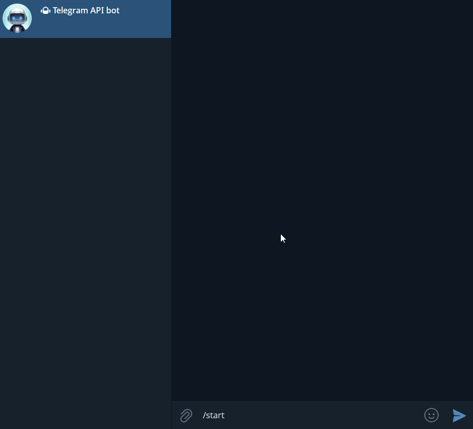

# AI Telegram Assistant

A production-ready Telegram bot template for **AI-powered customer support**. Provider-agnostic (OpenAI, Groq, Together, OpenRouter, Ollama), with **OpenAI function calling** wired in for order lookups, password resets, and human escalation. Fork it, point three tools at your backend, ship in 30 minutes.

> **Use this if you need:** a Telegram support channel for your SaaS, a frontline triage bot in front of Zendesk/Intercom, or a customer-facing assistant that can actually *do things* (cancel, refund, lookup) — not just talk.

[](https://www.python.org/downloads/)
[](tests/)
[](LICENSE)
[](docker-compose.yml)

---

## Demo

> _GIF demo coming — bot handles "I forgot my password, my email is alice@example.com" by calling `reset_password_link` tool and replying with the reset URL._

<!--
TODO replace with actual GIF:

-->

---

## Why this template

Most "Telegram + GPT" repos are thin wrappers — they pipe text in, pipe text out. That's fine for a chat toy, but not for a support bot.

This template adds three things that make it production-shaped:

1. **Function calling out of the box.** The bot doesn't just answer — it can look up an order, generate a password reset link, or escalate to a human ticket. Customize the three demo tools in `src/bot/tools.py` to call your own backend (REST, DB, Zendesk, internal API).
2. **Provider-agnostic.** Switch between OpenAI, Groq (free tier, fast), Together, OpenRouter, or local Ollama by changing one env var. No vendor lock-in.
3. **Operational essentials.** Per-user conversation memory in Redis, sliding-window rate limiting, health-check endpoint for orchestrators, structured token logging, Docker Compose deployment.

## Features

- **Function calling (OpenAI tool spec)** — three demo support tools (`lookup_order`, `reset_password_link`, `escalate_to_human`), trivial to extend
- **Multi-provider** — works with any OpenAI-compatible API: OpenAI, Groq, Together, OpenRouter, DeepInfra, Ollama, vLLM
- **Per-user conversation memory** in Redis (configurable history length, persists across restarts)
- **Custom system prompts per user** — `/system You are a billing specialist...`
- **Rate limiting** — sliding-window, per-user
- **Smart message splitting** — auto-handles Telegram's 4096-char limit
- **Token usage logging** — track per-request cost
- **Health check endpoint** — `/health` on configurable port for Kubernetes / Railway / Fly.io probes
- **Docker Compose** — one-command deployment
- **55 tests, all passing**

## Architecture

```
┌─────────────────────────────────────────────┐
│                Telegram API                  │
└──────────────────┬──────────────────────────┘
                   │
┌──────────────────▼──────────────────────────┐
│              Bot Application                 │
│  ┌──────────┐ ┌──────────┐ ┌──────────────┐ │
│  │ Handlers │ │ AI Client│ │ Rate Limiter │ │
│  └────┬─────┘ └────┬─────┘ └──────┬───────┘ │
│       │            │              │          │
│       │       ┌────▼────┐         │          │
│       │       │  Tools  │         │          │
│       │       │(funccall)│        │          │
│       │       └────┬────┘         │          │
│  ┌────▼────────────▼──────────────▼────────┐ │
│  │          Conversation Memory             │ │
│  └──────────────────┬──────────────────────┘ │
└─────────────────────┼───────────────────────┘
                      │
         ┌────────────▼────────────┐
         │     Redis (Storage)     │
         └─────────────────────────┘
                      │
         ┌────────────▼────────────┐
         │ AI Provider             │
         │ (OpenAI/Groq/Together/  │
         │  OpenRouter/Ollama)     │
         └─────────────────────────┘
```

## Quick Start (5 min, free)

The fastest free path: **Groq** (Llama 3.3 70B, free tier, sub-second latency).

### Prerequisites

- Docker and Docker Compose
- Telegram bot token from [@BotFather](https://t.me/BotFather)
- Free Groq API key from [console.groq.com](https://console.groq.com) — _or_ OpenAI key from [platform.openai.com](https://platform.openai.com)

### Setup

```bash
git clone https://github.com/extezzu/ai-telegram-assistant.git
cd ai-telegram-assistant
cp .env.example .env
```

Edit `.env`:

```env
TELEGRAM_BOT_TOKEN=8123456789:AA...

# Groq (free tier)
OPENAI_API_KEY=gsk_...
OPENAI_MODEL=llama-3.3-70b-versatile
OPENAI_BASE_URL=https://api.groq.com/openai/v1

# Turn on the demo support tools
ENABLE_FUNCTION_CALLING=true
```

Start it:

```bash
docker compose up -d
docker compose logs -f bot
```

Send `/start` to your bot in Telegram. Try: _"My email is alice@example.com, I forgot my password"_ — the bot will invoke the `reset_password_link` tool and reply with the (demo) reset URL.

## Customizing the support tools

The three demo tools live in [`src/bot/tools.py`](src/bot/tools.py). Each one is a five-line function returning mock data. To wire them to your backend:

```python
async def _handle_lookup_order(arguments: dict[str, Any]) -> dict[str, Any]:
    order_id = arguments["order_id"]
    # Replace the mock with a real call:
    async with httpx.AsyncClient() as client:
        resp = await client.get(
            f"{ORDERS_API_URL}/orders/{order_id}",
            headers={"Authorization": f"Bearer {ORDERS_API_TOKEN}"},
        )
    return resp.json()
```

To add a new tool:
1. Append a JSON schema to the `TOOLS` list (follows the [OpenAI tool spec](https://platform.openai.com/docs/guides/function-calling)).
2. Implement an async `_handle_<name>(arguments)` coroutine.
3. Register it in the `_DISPATCH` dict.

That's it — the model will pick it up on the next request.

## Provider matrix

| Provider     | Model example                                | Free tier | Speed | Notes |
|--------------|----------------------------------------------|-----------|-------|-------|
| OpenAI       | `gpt-4o-mini`                                | No        | Fast  | Best tool-call quality |
| Groq         | `llama-3.3-70b-versatile`                    | Yes       | Fastest | Sub-second, free demos |
| Together     | `meta-llama/Llama-3.3-70B-Instruct-Turbo`    | Limited   | Fast  | Cheap at scale |
| OpenRouter   | `anthropic/claude-3.5-sonnet`                | No        | Varies | 250+ models, unified bill |
| Ollama       | `llama3.1:8b`                                | Self-host | Local | No API costs, your hardware |

See `.env.example` for ready-to-paste configs for each.

## Commands

| Command            | Description                              |
|--------------------|------------------------------------------|
| `/start`           | Welcome message and bot introduction     |
| `/help`            | Show available commands                  |
| `/clear`           | Clear conversation history               |
| `/system <prompt>` | Set a custom system prompt for the user  |

## Configuration

| Variable                    | Default                | Description                                      |
|-----------------------------|------------------------|--------------------------------------------------|
| `TELEGRAM_BOT_TOKEN`        | —                      | Telegram Bot API token (required)                |
| `OPENAI_API_KEY`            | —                      | API key for the AI provider (required)           |
| `OPENAI_MODEL`              | `gpt-4o-mini`          | Model identifier                                 |
| `OPENAI_BASE_URL`           | OpenAI default         | Override for non-OpenAI providers                |
| `OPENAI_MAX_TOKENS`         | `1024`                 | Max tokens in response                           |
| `OPENAI_TEMPERATURE`        | `0.7`                  | Response temperature (0.0–2.0)                   |
| `ENABLE_FUNCTION_CALLING`   | `false`                | Enable the demo support tools                    |
| `REDIS_URL`                 | `redis://localhost:6379/0` | Redis connection URL                         |
| `MAX_CONVERSATION_LENGTH`   | `20`                   | Messages retained per user                       |
| `RATE_LIMIT_PER_MINUTE`     | `10`                   | Per-user message cap                             |
| `DEFAULT_SYSTEM_PROMPT`     | `You are a helpful...` | Default AI behavior                              |
| `HEALTH_CHECK_PORT`         | `8080`                 | HTTP port for `/health`                          |
| `LOG_LEVEL`                 | `INFO`                 | `DEBUG`, `INFO`, `WARNING`, `ERROR`              |

## Project layout

```
ai-telegram-assistant/
├── src/bot/
│   ├── main.py          # Entry point, bot setup, health server
│   ├── handlers.py      # Command and message handlers
│   ├── ai_client.py     # OpenAI-compatible API client + tool loop
│   ├── tools.py         # Function-calling tool definitions
│   ├── memory.py        # Conversation memory (Redis-backed)
│   ├── rate_limiter.py  # Per-user sliding-window rate limiting
│   ├── config.py        # Pydantic Settings from .env
│   └── utils.py         # Telegram message splitting
├── tests/               # 55 tests covering all modules
├── docker-compose.yml   # Bot + Redis stack
├── Dockerfile           # Slim Python 3.11 image
└── pyproject.toml       # Project metadata + ruff/pytest config
```

## Local development

```bash
pip install -e ".[dev]"
docker run -d -p 6379:6379 redis:7-alpine
cd src && python -m bot.main
```

Run tests:

```bash
python -m pytest tests/ -v
```

## Deployment

The repo ships with `docker-compose.yml` (bot + Redis). For managed hosts:

- **Railway / Fly.io / Render** — point at the Dockerfile, add the env vars from `.env.example`. The `/health` endpoint is exposed on `HEALTH_CHECK_PORT` (default 8080).
- **VPS** — `docker compose up -d` is the whole deployment.
- **Kubernetes** — wire the `/health` endpoint to your readiness/liveness probes.

## Tech stack

- **Python 3.11+** (async/await throughout)
- **python-telegram-bot v20+** (async Telegram Bot API)
- **OpenAI Python SDK** (used as a generic OpenAI-compatible client)
- **Redis** (persistent conversation storage)
- **Pydantic Settings** (type-safe config)
- **pytest + pytest-asyncio + fakeredis** (testing)
- **Ruff** (lint + format)
- **Docker Compose** (one-command deploy)

## License

MIT — fork freely.

## Contact

Built by [@extezzu](https://github.com/extezzu). Need a Telegram support bot wired to your backend (Zendesk, Intercom, internal API, custom DB)? Open an issue or message me on GitHub.
